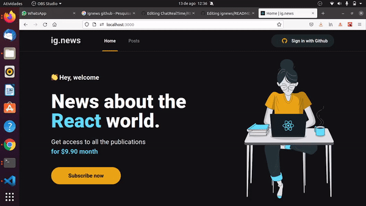

# ig.news

Application developed using Nextjs, to exercise the concepts of Static Site Generation (SSG), Server Side Rendering (SSR) and Serverless. The application uses the Next API Routes for integration with the Stripe payment platform, the FaunaDB database, in addition to the Prismic CMS.

  

### 🛠 Tools

The following tools were used in the construction of the project:

- [React](https://pt-br.reactjs.org/)
- [TypeScript](https://www.typescriptlang.org/)
- [NextJS](https://nextjs.org/)
- [FaunaDB](https://fauna.com/)
- [Prismic](https://prismic.io/)
- [Stripe](https://stripe.com/br)

### Stripe

It was the payment platform used by the application to subscribe to the service. Provides an easy-to-understand API and a Webhooks concept for communicating events to the application.

### FaunaDB

Fauna is a database for modern applications that enables communication with serverless backends.

### Prismic CMS

It was the CMS used by the application to create the Posts content, it provides a great integration with React and the Next.js framework

### Author
---

<a href="https://scontent.fmao1-1.fna.fbcdn.net/v/t1.6435-1/s200x200/47679598_935385643252349_408996459854168064_n.jpg?_nc_cat=108&ccb=1-3&_nc_sid=7206a8&_nc_eui2=AeFx-vfucNiFef0hArTvfJymsnp9NX0grnGyen01fSCucVWfc18H03vBBG8VjyVm3aWUDo_VsTUcMF82j9VYi8k0&_nc_ohc=1Q_dU6b5ackAX-e2rBo&_nc_ht=scontent.fmao1-1.fna&tp=7&oh=78b9ef95d81fd22f73d2374622207fab&oe=60B693C1">
 
  
 <b>Samuel Fonseca</b></a> <a href="https://blog.rocketseat.com.br/author/thiago//" title="Rocketseat">🚀</a>

Made with ❤️ by Samuel Fonseca 👋🏽!

 

